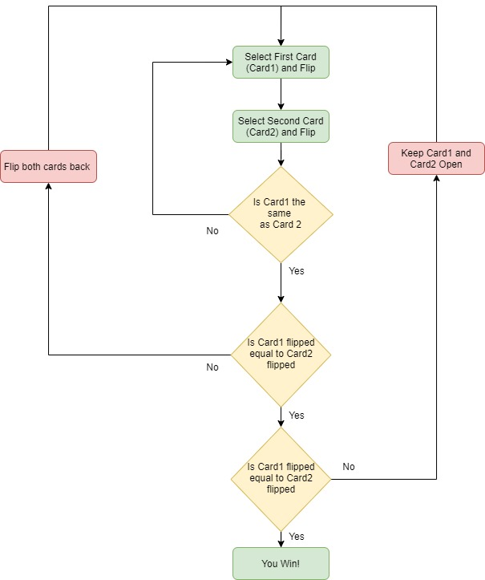
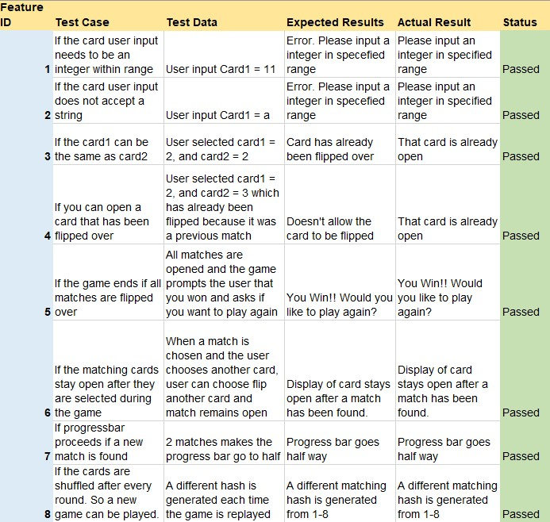

# Memory Game
Link to Repository: https://github.com/wcheng8/MemoryGame

## Sources
##Software Development Plan

### Scope & Purpose
The purpose of this project is to create a memory card game to gauge an individuals memory ability whilst having fun. This game will help solve the need of purchasing actual cards to play a memory game on. The target audience for this application would be anyone who wants to train their visual memory, and have fun while doing it. The typical person would play the game to see how fast they can complete the memory puzzle and how many attempts they take to do it. The less attempts the better! The individual would first select a card from the listed deck, by choosing the numbers on top of each card. This would open up the card and reveal the alphabet underneath. The user then chooses a second card to flip over, this will open up the second card and check if the letters of both cards match. If the alphabets of the first card and the second card match, the cards will remain open, and you will be prompted to select another pair, until all cards are flipped open. If they do not match, the cards will flip back over to the original position revealing the number on the card and you will be prompted to select another card. This game is a fun way of training your visual memory and having fun at the same time. The game can be played multiple times, and the cards would automatically shuffle and be placed in a different location. The matching letters are also randomized, simulating a real deck of cards. An alternative purpose of this game, would just to have fun and test you memory and luck to see how many attempts you would need to solve the 8 card memory game challenge. This could be then compared with others, to see how many attempts they would need to solve the challenge. 

### Features
Feature1: The ability to shuffle the cards to give randomized matches each play.
When the user selects all the matches in the current game, the user is prompted with a different game with a set number of matches with a randomized location on the board. This way the same game will not be repeated more than once and would allow the user to play the game again but with different card locations. 

Feature2: The ability to flip open the first card and second and keep it open if it is a match.
When the first and the second card is flipped over and matches. The matching cards would remain open, and you will be allowed to select a different pair of cards in the terminal until all matches are found and you beat the game! If the cards are not matches, the cards would close on the next attempt and the user would be prompted to select cards out of the cards on the screen.

Feature3: The ability to select cards within the deck board without selecting open cards
The cards on the deck board can be selected by the number ontop of the card. By selecting the number on the card in the terminal. This would flip over the card and reveal the alphabet underneath. If the card has already been flipped over, either it was selected previously if you are selecting the second card or you are selecting from a card that has already been flipped over. Then an error would arise and would ask the user to input another card that has not been flipped over. This would be the same if a string was inputed, or a number outside the card range.

### UI/UX Outline
The user will interact with the game on the terminal. The user will select a card by selecting the number indicated on the back of the card. This would then flip the card over and reveal the alphabet underneath. A second card will then be selected with the number on the back of the card. The user will need to select a card that is not a match or has not been selected previously, else the user will be asked for another input. If the user selects a string, special character or a number outside the range of the cards available, the user will be prompted to select correct card input.

### Control Flow Diagram

### Implementation Plan

### High Priority Features (Deadline: Day1/Day2)
Feature 1: Print out a set of cards

Using the box_display.rb and cardnum.rb. These two codes display the set of cards on the screen using print and puts statements in while loops, to indicate the cards like the following:

    def printline
        print "-XXXXX".colorize(:red)
    end

Feature 2: Allows user to select a card

Using userinput_test_case.rb. The code asks the user for the integer value on the cardback, it needs to but inputed a number_of_cards, which will be the maximum number:

    def askforcard1(number_of_cards)
        puts "Choose the first card (1-#{number_of_cards})"
        card1 = gets.chomp()
        return card1
    end

The user input is then tested using the same file, to see if it is a valid integer in the 3x3 game.

    def test_input1(matches, card1, card2,number_of_cards)
        while matches.include?(card1.to_i) || !(/^[1-${number_of_cards}]$/).match?(card1)
            if !(/^[1-#{number_of_cards}]$/).match?(card1)
                puts "Please input an integer in the specified range"
            else
                puts "That card is already open"
            end
            card1 = askforcard1()
        end
        return card1.to_i
    end

Feature 3: Allows user to flip the card to reveal letter

Using display_card_status.rb. Uses firstflip() method. This shows the flip character of the first card, this is done by storing the number and letter for the card in a hash and calling that hash.

    def firstflip(dimension, card, backside, matches,key)
        count = 1
        prettybox(3)
        for x in 0..dimension-1
            printxx()
            for y in 0..dimension-1
                if card == count || matches.include?(count)
                    printkeycount(key,count)
                elsif backside.key?(count)
                    printcount(count)
                else
                    printline()
                end
            count += 1
            end
            puts "---"
            printxx()
            prettybox(3)
        end
    end

Feature 4: Allows user to select second card and see if it is a match

Using display_card_status.rb. Similar to the feature 3, but uses the secondflip() method. The method calls and prints the hash storing the number and letter to open the card. The only difference is that another condition is added to prevent the user from selecting the same card as the first.

    def secondflip(dimension, card, card2,backside,matches ,key)
    prettybox(3)
    count = 1
    for x in 0..dimension-1
        printxx()
            for y in 0..dimension-1 
            if card == count || card2 == count|| matches.include?(count)
                printkeycount(key,count)
           ...
    end

Feature 5: If cards is not a match, flip cards back over and tell user it isn't a match.

Using match_case.rb. Checks if the alphabet key for card1 is the same as card2. If it is push to a correct_match array in correct_match() and also delete the from the backside key array in match_condition()

    def match_condition(a,b,backside)
        if backside[a] == backside[b]
            p "It's a match!!"
            backside.delete(a)
            backside.delete(b)
            return backside
        else
            p "Tough Luck try again :("
            return backside
        end
    end

    def correct_match(a,b,backside,correct_match)
        if backside[a] == backside[b]
            correct_match.push(a)
            correct_match.push(b)
            return correct_match
        else
            return correct_match
        end
    end

### Medium Priority Features (Deadline: Day3)
Feature 6: Allows user to keep matching cards open

Using display_card_status.rb. Similar to feature 3,4, but uses init_state() method. The init_state() method checks if the cards are in an existing match key, which gets appended whenever a correct match is created. 

    def init_state(dimension, backside,matches,key)
        count = 1
        prettybox(3)
        #Creates dimension of rows of cards
        for x in 0..dimension-1
            printxx()
            for y in 0..dimension-1
                if backside.key?(count)
                    printcount(count)
                elsif matches.include?(count)
                    printkeycount(key,count)
                ...
    end

Feature 7: Allows user to win if all matches are found

Using the main program game.rb. This loops all the general code in a while loop which checks if the temporary backside array is empty from matches.

    while !backside.empty?
        ...
        if backside.empty? 
            system "clear"
            win_display()
        else
            puts "Keep Going!"
        end
    end

Feature 8: Checks if user input is a valid integer within range

Using userinput_test_case.rb. In test_input1(). An addon to Feature 2, uses a regex match case to allow cards to be entered in a certain range as integer values only.

    def test_input1(matches, card1, card2, number_of_cards)
        while matches.include?(card1.to_i) || !(/^[1-8]$/).match?(card1)
            if !(/^[1-8]$/).match?(card1)
                puts "Please input an integer in the specified range"
            ...
    end

### Low Priority Features (Deadline: Day3)
Feature 9: Randomize the position of the cards, so every game will be different

Using random_hash.rb. Creates a random hash by creating a random array of matching pairs and calls the character from a character set array.

    def rand_alph(number_of_cards)
    rand_hash = {}
    rand_arr = []
    charset = Array("A".."Z")
    for i in 1..number_of_cards
        temp = rand(1..number_of_cards)
        while rand_arr.include?(temp)
            temp = rand(1..number_of_cards)
        end
        rand_arr.push(temp)
    end

    for i in 0..rand_arr.length-1
        if rand_arr[i] > number_of_cards/2
            p "RandArr#{rand_arr[i]}"
            rand_arr[i] = (rand_arr[i]%(number_of_cards/2)) + 1
            p "Adjusted #{rand_arr[i]}"
        end
    end
    p rand_arr
    for i in 1..rand_arr.length
        rand_hash[i] = charset[rand_arr[i-1]]
    end

### Test Cases
Test1 Case:
Test if the user can input a card outside the specefied range of cards that are displayed on the deck. Or if the program accepts a string as a card input.

Test2 Case:
Test if the user can flip a card if the card has already been flipped over, either because it is an existing match or it has been flipped over previously because it was selected before.

Test3 Case:
Test that when the user wins if the application prompts the user to play again and generates another shuffled game for the user to play.

### Project Management platform on github
Link: https://github.com/wcheng8/MemoryGame/projects

